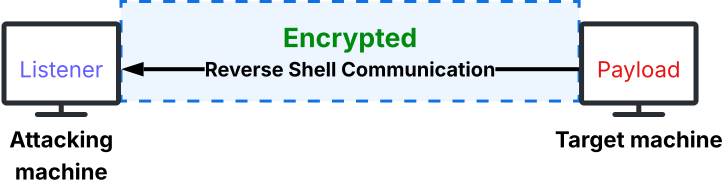

Bypassing Security Controls
**Chapter** 7 &emsp;|&emsp; **Page** 150

There will be times when you find that the utility of the shell you've established is limited due to the environment.
The shell itself could be limited, or the target environment may reduce the number of packages available in order to harden the system.
 
For instance, a slimmed down container such as p-web-02 (\*one of the book's demo target systems) runs with the bare minimum software required to function.
A lack of built-in or installed binaries is normal for cloud-hosted web application servers. This is due to performance, security, and resource optimization.
A slim system image requires less maintenance overhead and provides faster deployment times.
 
The objective in this section is to highlight a few high-level techniques to hide reverse shell communications or bypass security restrictions in hardened environments.
Techniques such as these can help evade initial access security measures and allow us to maintain control over compromised systems.

## Encrypting and Encapsulating Traffic
To evade detection, reverse shells can leverage encryption and encapsulation techniques to hide malicious traffic within legitimate protocols or connections.
By *encrypting* the communication, we render the contents in the reverse shell traffic unreadable, making it difficult for security devices to identify any malicious payload or commands being sent.
 
With *encapsulation*, we conceal the reverse shell traffic within innocuous protocals or already-encrypted connections. This technique disguises the reverse shell communications as legitimate traffic.

##### Diagram of how an encrypted tunnel between a compromised server and a attacking machine could work:

 
 

## Alternating Between Destination Ports
