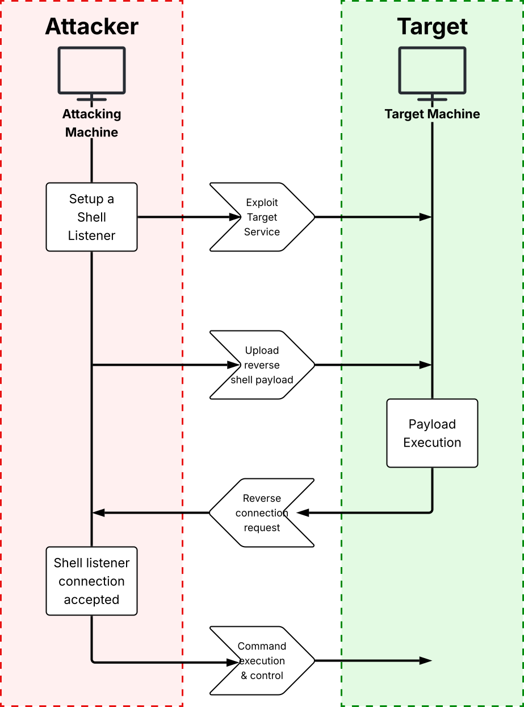

# How Reverse Shells Work
**Chapter** 7 &nbsp;&nbsp;&nbsp;&nbsp;|&nbsp;&nbsp;&nbsp;&nbsp; **Page**: 144

Reverse shells are commonly used for post-exploitation activities. 
They provide attackers initial access to a target that is more stable than a web shell 
and maintains control over compromised machines without the need to directly connect to it. 
 
The term *reverse* references the direction of initial network traffic. With traditional shells, 
the attacker's machine is typically the one to initiate a connection to the compromised machine 
to issue commands and control it (*attacker-machine -> target-machine*). However, with reverse  
shells, the target machine is the one to initiate a connection with the attacker's machine  
(*target-machine -> attacker-machine*).

## Ingress vs. Egress Controls

## Shell Payloads and Listeners

## The Communication Sequence
##### The sequence of network communications involved in the use of reverse shells:

### Creating a Reverse Shell Involves the Following Steps:
1. **Setting up a shell listener:**  
   - The attacker machine initializes a shell listener running on a specific port that is accessible from the internet.  
2. **Exploiting the target server:**  
   - The attacker compromises the target system through a vulnerability.  
3. **Uploading a reverse shell payload:**  
   - The attacker crafts a reverse shell payload and delivers it by exploiting the underlying vulnerability in the target system.  
4. **Executing the payload:**  
   - The payload is executed on the target server.  
5. **Requesting a reverse connection:**  
   - The payload attempts to connect to the attacker's machine, acting as the client.  
6. **Accepting the shell connection:**  
   - The listener receives the incoming connection and establishes a bidirectional communication channel with the target machine over the network.  
7. **Executing commands and gaining server control:**  
   - With the reverse shell connection established, the attacker gains control over the compromised target system and may execute shell commands remotely.
